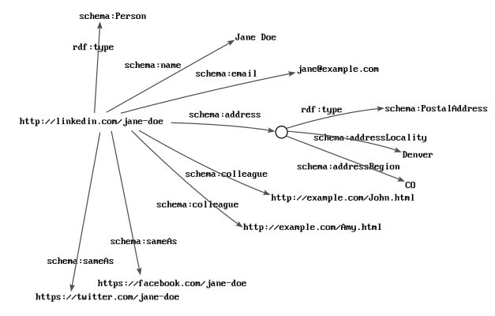
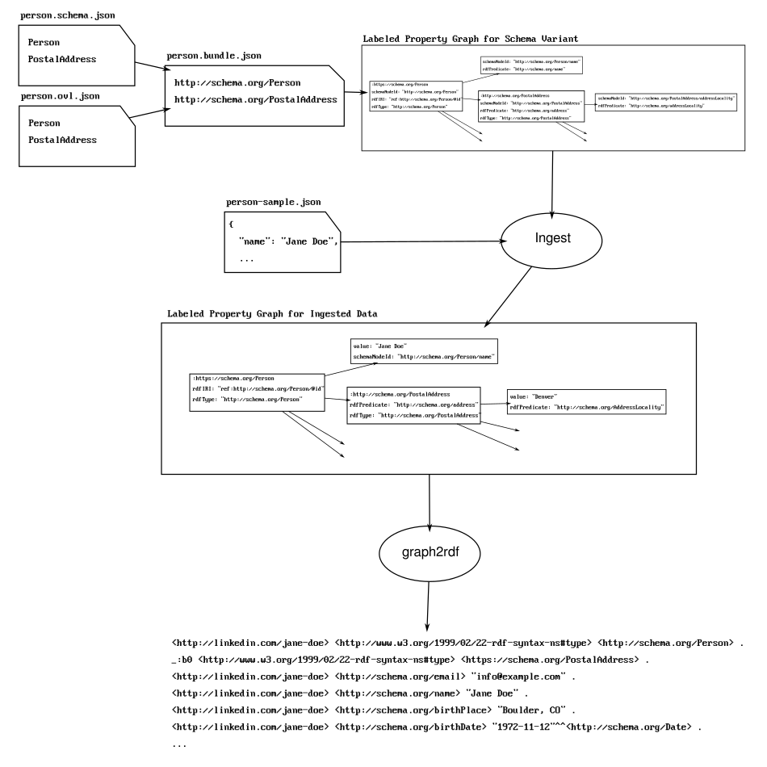
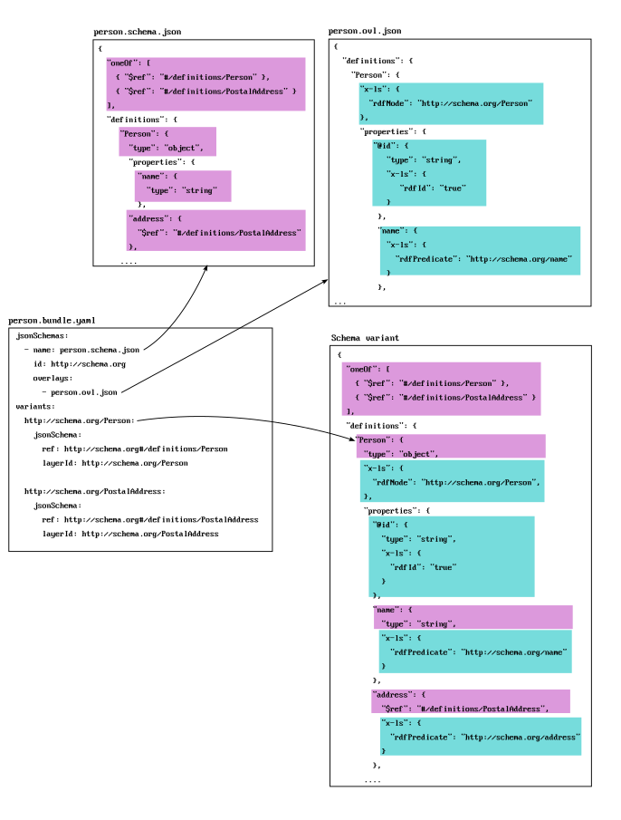

# json2rdf - JSON-LD vs. Layered Schemas

This is a proof-of-concept command-line application that demonstrates
how layered JSON schemas can be used to transform JSON documents into
RDF. There are several advantages of using layered JSON schemas
instead of JSON-LD: JSON schemas are widely available, they describe
valid JSON documents expected by data exchange partners or API users
in a machine-readable manner so they can be used to validate JSON
documents or to generate code for different languages.

## Layered Schemas

The layered schema architecture tools are available
[here](https://github.com/cloudprivacylabs/lsa). Here's a short
overview of the idea:

A **schema variant** is composed of a schema that defines data
structures, and zero or more overlays (hence the name "layered
schemas") that annotate the schema with semantic information and
metadata. These annotations adjust and enrich the schema by adding or
removing constraints, metadata, processing information such as
pointers to normalization tables, or mappings to a common ontology,
which is what we will use here.

Schema variants are useful in an environment where there are multiple
varying implementation of a standard, or where there are multiple
standards or proprietary data structures within an
ecosystem. Different schema variants can be used to ingest and
harmonize disparate data structures.

This proof-of-concept uses the LSA packages to compose schema variants
and ingest JSON documents. The `layers` program from the LSA
repository can also be used together with `json2rdf` program in this
repository.

## JSON-LD/RDF Translation

Let's consider the following simple JSON-LD document describing a
`Person`. It uses the `https://schema.org` ontology to describe a
person object:

``` javascript
{
    "@context": "https://schema.org",
    "@type": "Person",
    "@id": "http://linkedin.com/jane-doe",
    "address": {
        "@type": "PostalAddress",
        "addressLocality": "Denver",
        "addressRegion": "CO"
    },
    "colleague": [
        "http://example.com/John.html",
        "http://example.com/Amy.html"
    ],
    "email": "jane@example.com",
    "name": "Jane Doe",
    "sameAs" : [ "https://facebook.com/jane-doe",
                 "https://twitter.com/jane-doe"]
}
```

JSON-LD uses the `context` to map JSON keys to RDF. This is done by
mapping individual object properties to concepts in an ontology (the
`context` defines the "semantics" of the data.) The graphical RDF
representation for this object is:



As you can see, the structure of the output graph depends on both the
JSON-LD context mappings and the structure of the JSON input file. A
JSON object in the input file is represented as a node in the output
graph, and a JSON property is represented as an edge (predicate). If
the JSON object does not have an `@id`, then it is translated into a
blank node.

## JSON/RDF Translation using a Layered JSON Schema

Now let's see how the same thing can be done using a layered JSON
schema. LSA tools create a labeled property graph (LPG) for an
ingested JSON object. This LPG is a self-describing object in the
sense that it contains the values of the input document combined with
the annotations and metadata specified in the schema variant used to
ingest it. We will use this LPG to produce the RDF output using the
following annotations:

  * `rdfPredicate`: Declares a JSON property as an RDF predicate
    (edge), with a mapping to a term. This is similar to mapping a
    JSON property using JSON-LD context. The difference here is that
    using a layered schema, we can explicitly declare that a JSON
    property should be translated as a predicate instead of a node.
  * `rdfIRI`: Declares a JSON property as an RDF node, while also
    providing its IRI mapping. The IRI can be a fixed value, or it can
    be collected from another node in the input document (like, the
    `@id` property in our example.)
  * `rdfType`: Defines the type of the literal, or the type of the
    node.
  * `rdfLang`: Defined the language of a litaral.

The following image illustrates the data ingestion process.



A JSON schema ([person.schema.json](person.schema.json)) defines the structure of the JSON
objects (in this example, `Person` and `PostalAddress`.) An overlay
(`person.ovl.json`) annotates the schema to define mappings to
`schema.org` terms. These are combined using a bundle file
(`person.bundle.yaml`) that first composes a schema variant by
combining the schema and the overlay, and then creates a labeled
property graph (LPG) based on this schema variant. This schema variant
LPG contains a node for every JSON data point (every object, array,
and value.) Data ingestion process takes the input data file
(`person-sample.json`) and interprets it using the schema variant LPG,
creating a new LPG for the data object. This LPG becomes a
self-describing object that contains all input data values and
corresponding schema annotations.


First, we need a JSON schema for this object. The following JSON
schema contains the definitions for two objects, a `Person` and a
`PostalAddress`, and can be used to validate either object:

``` javascript
{
    "oneOf": [
      { "$ref": "#/definitions/Person" },
      { "$ref": "#/definitions/PostalAddress" }
    ],
    "definitions": {
        "PostalAddress": {
            "type": "object",
            "properties": {
                "addressLocality": {
                    "type": "string"
                },
                "addressRegion": {
                    "type": "string"
                }
            }
        },
        "Person": {
            "type": "object",
            "properties": {
                "id": {
                    "type": "string",
                    "format": "uri"
                },
                "address": {
                    "$ref": "#/definitions/PostalAddress"
                },
                "colleague": {
                    "type": "array",
                    "items": {
                        "type": "string"
                    }
                },
                "email": {
                    "type": "string",
                    "format": "email"
                },
                "name": {
                    "type": "string"
                },
                "sameAs" : {
                     "type": "array",
                    "items": {
                        "type": "string",
                        "format": "uri"
                    }
                }
            }
        }
    }
}
```


Then, we create an overlay to specify the RDF translation. Similar to
a JSON-LD context, the overlay will map JSON properties to their
schema.org ontology equivalents. The following tags are sufficient to
specify such a mapping:

  * rdfIRI: Marks the JSON property as an IRI node
  * rdfPredicate: Marks the JSON property as an RDF predicate (edge).
  * rdfType: Specifies the RDF type of an object, or the type of a literal
  * rdfLang: Specifies the language of a literal
  
Using these tags, we define the overlay:

``` javascript
{
    "definitions": {
        "PostalAddress": {
            "x-ls": {
                "rdfType": "https://schema.org/PostalAddress",
                "rdfIRI": "blank"
            },
            "properties": {
                "addressLocality": {
                    "x-ls": {
                        "rdfPredicate" : "http://schema.org/addressLocality"
                    }
                },
                ...
            }
        },
        "Person": {
            "x-ls": {
                "rdfType": "http://schema.org/Person",
                "rdfIRI": "ref:http://schema.org/Person/@id"
            },
            "properties": {
                "@id": {
                    "type": "string"
                },
                "address": {
                    "x-ls": {
                        "rdfPredicate": "http://schema.org/address"
                    }
                },
                "colleague": {
                    "x-ls": {
                        "rdfPredicate": "http://schema.org/colleague"
                    }
                },
                "name": {
                    "x-ls": {
                        "rdfPredicate": "http://schema.org/name"
                    }
                },
                "birthDate": {
                    "x-ls": {
                        "rdfPredicate": "http://schema.org/birthDate",
                        "rdfType": "http://schema.org/Date"
                    }
                },
 	              "sameAs" : {
                    "x-ls": {
                        "rdfPredicate": "http://schema.org/sameAs"
                    }
                },
                ...
            }
        }
    }
}
```

There are several things to note in the overlay:

  * The overlay matches the schema structurally. The JSON path
``` javascript

    `/definitions/Person` of the overlay annotates the properties
    under the same path in the schema.
  * All annotations are under the `x-ls` JSON object. This is the
    recommended way of adding extensions to a JSON schema: it starts
    with `x-`. `ls` standard for `layered schema`. The layered schema
    processor builds a composite schema by adding `x-ls` objects to
    corresponding places in the schema.


We have to first come up with a
meta-language to annotate the schema. The following annotations would
work:

  * `rdfIRI`: If a JSON property is annotated with `rdfIRI`, then that
    property will be translated to an RDF IRI node, or to an RDF blank
    node. Let's define the following convention:
    
   This uses the given value as the IRI node:

``` javascript
"rdfIRI": "value"
```

Example:

Input:
``` javascript
"PostalAddress": {
    "x-ls": {
       "rdfIRI": "http://schema.org/PostalAddress"
    }
```
Output:

The RDF node corresponding to the "PostalAddress" property with IRI:
"http://schema.org/PostalAddress"


   This creates a blank node for the JSON property:
    
``` javascript
"rdfIRI": "blank"
```

Example:

Input:
``` javascript
"PostalAddress": {
    "x-ls": {
       "rdfIRI": "blank"
    }
```
Output:

The RDF node corresponding to the "PostalAddress" property will be a blank node.


   This uses the referenced node value to create an IRI node. The
   node value must be an IRI. The first node accessible from the
   current node that has `schemaNodeId: <reference>` value will be
   used.

``` javascript
"rdfIRI": "ref:<reference>
```

Example:

Input:

``` javascript
"Person": {
    "x-ls": {
        "rdfIRI": "ref:http://schema.org/Person/@id"
    },
```

Output:

The RDF node corresponding to the "Person" property will have the IRI
extracted from the "@id" property (the LPG node with `schemaNodeId:
http://schema.org/Person/@id`) under the "Person" object.

   This uses the JSON property value to create an IRI node. The JSON
   property value must be an IRI:

``` javascript
"rdfIRI": "."
```





Now we annotate this schema by defining mappings to the schema.org
ontology using an overlay. Let's say we will use `rdfNode` to mean the
data field should be translated as an RDF subject or object node. For instance:

``` javascript
...
"definitions": {
    "PostalAddress": {
        "x-ls": {
            "rdfNode": "http://schema.org/PostalAddress"
        },
    }
...
```

The `definitions/PostalAddress` will match the `PostalAddress`
definitions in the original schema.

``` javascript
{
    "definitions": {
        "PostalAddress": {
            "type": "object",
            "x-ls": {
                "rdfNode": "http://schema.org/PostalAddress"
            },
            "properties": {
                "addressLocality": {
                    "x-ls": {
                        "rdfPredicate" : "http://schema.org/addressLocality"
                    }
                },
                "addressRegion": {
                    "x-ls": {
                        "rdfPredicate": "http://schema.org/addressRegion"
                    }
                }
            }
        },
        "Person": {
            "type": "object",
            "x-ls": {
                "rdfNode": "http://schema.org/Person"
            },
            "properties": {
                "id": {
                    "x-ls": {
                        "rdfId": "true"
                    }
                },
                "address": {
                    "x-ls": {
                        "rdfPredicate": "http://schema.org/address"
                    }
                },
                "colleague": {
                    "x-ls": {
                        "rdfPredicate": "http://schema.org/colleague"
                    }
                },
                "email": {
                    "x-ls": {
                        "rdfPredicate": "http://schema.org/email"
                    }
                },
                "name": {
                    "x-ls": {
                        "rdfPredicate": "http://schema.org/name"
                    }
                },
	            "sameAs" : {
                    "x-ls": {
                        "rdfPredicate": "http://schema.org/sameAs"
                    }
                }
            }
        }
    }
}
```


layers ingest json --bundle person.bundle.yaml --type http://schema.org/Person person-sample.json 
