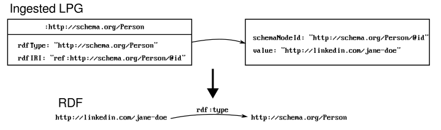
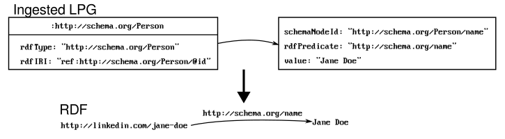

# json2rdf - JSON-LD vs. Layered Schemas

JSON-LD is a format for encoding linked data. It allows mapping of
JSON properties to a web ontology to enable interoperability between
differents systems. JSON-LD also offers a JSON-based encoding of
knowledge graphs. A JSON-LD document can be translated into RDF and
vice-versa.

This is a proof-of-concept to show that layered JSON schemas offer the
same functionality. A layered JSON schema is simply a JSON schema with
additional overlays that annotate the schema. A JSON document can be
interpreted with such a layered schema to build linked data
representations in RDF.

There are several advantages of using layered JSON schemas: JSON
schemas are widely available in the industry to specify data
standards. They describe valid JSON documents expected by data
exchange partners or API users in a machine-readable manner so they
can be used to validate JSON documents or to generate code for
different languages.

## Layered Schema Architecture (LSA)

The LSA tools are available
[here](https://github.com/cloudprivacylabs/lsa). Here's an overview
of the idea:

A **schema variant** is composed of a schema that defines data
structures, and zero or more overlays (hence the name "layered
schemas") that annotate the schema with semantic information and
metadata. These annotations adjust and enrich the schema by adding or
removing constraints, metadata, processing information such as
pointers to normalization tables, or mappings to an ontology.

Schema variants are useful in an environment where there are multiple
varying implementation of a standard, or where there are multiple
standards or proprietary data structures within an
ecosystem. Different schema variants can be used to ingest and
harmonize disparate data structures.

This proof-of-concept uses the LSA packages to compose schema variants
and ingest JSON documents. The `layers` program from the LSA
repository can also be used together with `json2rdf` program in this
repository.

## JSON-LD/RDF Translation

Let's consider the following simple JSON-LD document describing a
`Person`. It uses the `https://schema.org` ontology to describe a
person object:

``` javascript
{
    "@context": "https://schema.org",
    "@type": "Person",
    "@id": "http://linkedin.com/jane-doe",
    "address": {
        "@type": "PostalAddress",
        "addressLocality": "Denver",
        "addressRegion": "CO"
    },
    "colleague": [
        "http://example.com/John.html",
        "http://example.com/Amy.html"
    ],
    "email": "jane@example.com",
    "name": "Jane Doe",
    "sameAs" : [ "https://facebook.com/jane-doe",
                 "https://twitter.com/jane-doe"]
}
```

JSON-LD uses the `context` to map JSON keys to RDF. This is done by
mapping individual object properties to concepts in an ontology (the
`context` defines the "semantics" of the data.) The graphical RDF
representation for this object is:


As you can see, the structure of the output graph depends on both the
JSON-LD context mappings and the structure of the JSON input file. A
JSON object in the input file is represented as a node in the output
graph, and a JSON property is represented as an edge (predicate). If
the JSON object does not have an `@id`, then it is translated into a
blank node.

## JSON/RDF Translation using a Layered JSON Schema

### Idea

Now let's see how this can be done using a layered JSON schema. The
idea is to write a JSON schema to describe the data structures
(`Person` and `PostalAddress`), and combine it with an overlay that
describes how to translate JSON data points into RDF. For example:

``` javascript
"email": "jane@example.com"
```

should be translated as an RDF predicate `http://schema.org/email` and
an RDF literal object `jane@example.com`. So the overlay should assign
`email` property to `http://schema.org/email` IRI, and also should
specify that it should be an RDF predicate. The following annotation
serves this purpose:

``` javascript
"rdfPredicate": "http://schema.org/email"
```

As another example, consider the `Person` object:

``` javascript
{
   "@id": "http://linkedin.com/jane-doe",
   ...
}
```

This should be translated to an RDF IRI node
`http://linkedin.com/jane-doe`, which is given in the `@id`
attribute. So we should be able to tell that an RDF IRI node should be
created from a given data element to represent this object:

``` javascript
"rdfIRI": "ref:<pointer to the @id field>
```

Based on this, we devise the following tags:

  * `rdfPredicate`: Declares a JSON property as an RDF predicate
    (edge), with a mapping to a term. This is similar to mapping a
    JSON property using JSON-LD context. The difference here is that
    using a layered schema, we can explicitly declare that a JSON
    property should be translated as a predicate instead of a node.
  * `rdfIRI`: Declares a JSON property as an RDF node, while also
    providing its IRI mapping. The IRI can be a fixed value, or it can
    be collected from another node in the input document (like, the
    `@id` property in our example.)
  * `rdfType`: Defines the type of the literal, or the type of the
    node.
  * `rdfLang`: Defined the language of a litaral.
  
### LSA Data Ingestion

LSA ingests a data file based on a schema variant (remember: a schema
variant is a schema annotated using overlays) and produces a labeled
property graph. The following image illustrates the data ingestion
process.


The JSON schema [person.schema.json](person.schema.json) defines the
structure of the JSON objects, in this example, `Person` and
`PostalAddress`. The overlay [person.ovl.json](person.ovl.json)
annotates this schema to define the mappings to `schema.org` terms
using the above tags. The bundle file
[person.bundle.yaml](person.bundle.yaml) combines the schema and the
overlay, and defines the schema variant. [The schema variant itself is
an LPG](compiled-schema-variant.svg?raw=1).  This schema variant LPG contains a node for every JSON data
point (every object, array, and value.) Data ingestion process takes
the input data file [person-sample.json](person-sample.json) and
interprets it using the schema variant LPG, [creating a new LPG for the
data object](ingested-json-lpg.svg?raw=1). This LPG becomes a self-describing object that contains
all input data values and corresponding schema annotations. We then
take this LPG, use the RDF annotations at each node, and produce the
RDF output.

### The Overlay: Defining the RDF Translation

There are several things to note in the overlay:

  * The overlay matches the schema structurally. The JSON path
    `/definitions/Person` of the overlay annotates the properties
    under the same path in the schema.
  * All annotations are under the `x-ls` JSON object. This is the
    recommended way of adding extensions to a JSON schema: it starts
    with `x-`. `ls` standard for `layered schema`. The layered schema
    processor builds a composite schema by adding `x-ls` objects to
    corresponding places in the schema.


Let's take a deeper look at how the schema and the overlay are
defined. The schema defines the object `Person` as follows:

``` javascript
{
    "definitions": {
        "Person": {
            "type": "object",
            "properties": {
              "name": {
                 "type": "string"
              },
             ...
```

The overlay follows the same structure, but adds the tags under the
`x-ls` object:

``` javascript
{
    "definitions": {
        "Person": {
            "x-ls": {
                "rdfType": "http://schema.org/Person",
                "rdfIRI": "ref:http://schema.org/Person/@id"
            },
            "properties": {
              "@id": {
                 "type": "string"
              },
            ...
```

The schema variant is a composition of the two:

``` javascript
{
    "definitions": {
        "Person": {
            "type": "object",
            "x-ls": {
                "rdfType": "http://schema.org/Person",
                "rdfIRI": "ref:http://schema.org/Person/@id"
            },
            "properties": {
              "@id": {
                 "type": "string"
              },
              "name": {
                 "type": "string"
              },
            ...
```

When the input JSON is ingested, this schema variant results in the
LPG shown below. As you can see, the LPG contains the schema
annotations as well as the input data. We can process the annotations
in each node to create the RDF output. This creates an RDF IRI node
with value taken from the `@id` property under `Person`, and with type
`http://schema.org/Person`. Note that the original schema does not
contain the `@id` property. That is added by the overlay. The output
looks like:



Similarly, the following overlay assigns `http://schema.org/name` to
the `Person/name` property, and declares it as an RDF predicate. Since
`name` has a value in the ingested LPG, it will be translated to RDF
as an edge connecting to a literal node:

``` javascript
{
    "definitions": {
        "Person": {
           "properties": {
                "name": {
                    "x-ls": {
                        "rdfPredicate": "http://schema.org/name"
                    }
                },
            ...
```

This produces:




For `rdfIRI`, `json2rdf` uses these conventions:

   * The following uses the given value as the IRI node:

``` javascript
"rdfIRI": "value"
```

Example:

Input:
``` javascript
"PostalAddress": {
    "x-ls": {
       "rdfIRI": "http://schema.org/PostalAddress"
    }
```
Output:

The RDF node corresponding to the "PostalAddress" property with IRI:
"http://schema.org/PostalAddress"


   * The following creates a blank node for the JSON property:
    
``` javascript
"rdfIRI": "blank"
```

Example:

Input:
``` javascript
"PostalAddress": {
    "x-ls": {
       "rdfIRI": "blank"
    }
```
Output:

The RDF node corresponding to the "PostalAddress" property will be a blank node.


   * The following uses the referenced node value to create an IRI node. The
   node value must be an IRI. The first node accessible from the
   current node that has `schemaNodeId: <reference>` value will be
   used.

``` javascript
"rdfIRI": "ref:<reference>
```

Example:

Input:

``` javascript
"Person": {
    "x-ls": {
        "rdfIRI": "ref:http://schema.org/Person/@id"
    },
```

Output:

The RDF node corresponding to the "Person" property will have the IRI
extracted from the "@id" property (the LPG node with `schemaNodeId:
http://schema.org/Person/@id`) under the "Person" object.

   * The following uses the JSON property value to create an IRI
   node. The JSON property value must be an IRI:

``` javascript
"rdfIRI": "."
```

### Algorithm

The algorithm to convert an ingested data LPG into RDF using these
annotations is implemented in [graph2rdf.go](graph2rdf.go). The
algorithm sketch is as follows:


  * We first build the top-level nodes. These are nodes that have
    `rdfIRI` annotation. We keep a mapping between input LPG nodes and
    the RDF nodes. This step builds a list of input graph nodes for
    which RDF nodes are built.
  * Using the list of graph nodes built in the previous step of the
    previous iteration, we process all graph nodes that are connected
    with `rdfPredicate`, and extend the RDF graph in a breadth-first
    manner. We put every new input graph nodes for which a non-literal
    RDF node is generated to the list of nodes, and iterate as long as
    the list of nodes is nonempty.

## Running

You can run the `json2rdf` program as follows:

``` 
  json2rdf --bundle person.bundle.yaml --type http://schema.org/Person person-sample.json
```

Alternatively, you can first ingest the JSON file using LSA tools, and
then pass the output graph to json2rdf:

``` 
  layers ingest json --bundle person.bundle.yaml --type http://schema.org/Person person-sample.json | json2rdf 
```

Which produces:

``` 
<http://linkedin.com/jane-doe> <http://www.w3.org/1999/02/22-rdf-syntax-ns#type> <http://schema.org/Person> .
_:b0 <http://www.w3.org/1999/02/22-rdf-syntax-ns#type> <https://schema.org/PostalAddress> .
<http://linkedin.com/jane-doe> <http://schema.org/email> "info@example.com" .
<http://linkedin.com/jane-doe> <http://schema.org/name> "Jane Doe" .
<http://linkedin.com/jane-doe> <http://schema.org/birthPlace> "Boulder, CO" .
<http://linkedin.com/jane-doe> <http://schema.org/birthDate> "1972-11-12"^^<http://schema.org/Date> .
<http://linkedin.com/jane-doe> <http://schema.org/height> "71" .
<http://linkedin.com/jane-doe> <http://schema.org/gender> "female" .
<http://linkedin.com/jane-doe> <http://schema.org/address> _:b0 .
<http://linkedin.com/jane-doe> <http://schema.org/colleague> "http://www.example.com/John.html" .
<http://linkedin.com/jane-doe> <http://schema.org/colleague> "http://www.example.com/Jane.html" .
<http://linkedin.com/jane-doe> <http://schema.org/sameAs> "https://www.facebook.com/" .
<http://linkedin.com/jane-doe> <http://schema.org/sameAs> "https://www.linkedin.com/" .
<http://linkedin.com/jane-doe> <http://schema.org/sameAs> "http://twitter.com/" .
_:b0 <http://schema.org/addressLocality> "Denver" .
_:b0 <http://schema.org/addressRegion> "CO" .
_:b0 <http://schema.org/postalCode> "80123" .
_:b0 <http://schema.org/streetAddress> "100 Main Street" .
```

So this is how you can generate RDF from a JSON document using a JSON
schema describing the format of the input documents, a JSON schema
overlay that describes the RDF mapping, and a bundle that combines the
schema and the overlay.

The important takeaways are:

  * The shape of the RDF output can be better controlled by extending
    the tags and the translation algorithm. A JSON document can be
    translated in multiple ways to produce different RDF outputs.
  * The input to `json2rdf` is an LPG. LSA supports other schema
    formats. It is possible to translate an XML document or a CSV file
    to an RDF using the same framework.
  * LSA supports multiple data types. It is possible to normalize and
    translate non-standard date/time representations.
  * Unlike a JSON-LD document, JSON schemas provide structural
    validation.
